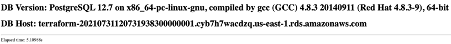
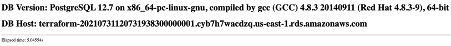

### Improve perfomance using redis

[https://acloudguru.com/blog/engineering/cloudguruchallenge-improve-application-performance-using-amazon-elasticache?utm_source=linkedin&utm_medium=social&utm_campaign=cloudguruchallengee](https://acloudguru.com/blog/engineering/cloudguruchallenge-improve-application-performance-using-amazon-elasticache?utm_source=linkedin&utm_medium=social&utm_campaign=cloudguruchallengee)

For accomplish this issue I required:

- a valid AWS profile
- a valid KeyPair to be used in the EC2.
- Terraform

Steps Implement RDS,VPC,EC2,REDIS using Terraform:

See code [here](https://github.com/malpanez/acg-app-performance-challenge)

Log by ssh Inside the public ec2:

ssh ec2-user@xxx.xxx.xxx.xxx -i key

Ensure that everything from the user-data.bash it's installed and start the configuration around the:

1.  nginx (install and apply the configuration given for redirection when using /app to the port 5000
2.  ensure that all the pre-requisites regarding python are in place (install python modules: psycopg2-binary, postgres, flask, parserconfig, redis)
3.  configure the database.ini file:

Note: there's no problem in show full code as it's a Cloud Playground and will be deleted by when it's published.

```ini
[postgresql]
host=terraform-20210731120731938300000001.cyb7h7wacdzq.us-east-1.rds.amazonaws.com
database=postgres
user=postgres
password=postgres

[redis]
redis_url=redis://redis-cache.x2mygh.0001.use1.cache.amazonaws.com:6379
```

4.  Modify the app.py given once you include the ElastiCache, here's the final code:

```python
# /usr/bin/python2.7
import psycopg2
from configparser import ConfigParser
from flask import Flask, request, render_template, g, abort
import time
import redis

def config(filename='config/database.ini', section='postgresql'):
    # create a parser
    parser = ConfigParser()
    # read config file
    parser.read(filename)
  # get section, default to postgresql
    db = {}
    if parser.has_section(section):
        params = parser.items(section)
        for param in params:
            db[param[0]] = param[1]
    else:
        raise Exception('Section {0} not found in the {1} file'.format(section, filename))

    return db

def fetch(sql):
    # connect to database listed in database.ini
    ttl = 10 # Time to live in seconds
    try:
       params = config(filename='config/database.ini',section='redis')
       cache = redis.Redis.from_url(params['redis_url'])
       result = cache.get(sql)

       if result:
         return result
       else:
         # connect to database listed in database.ini
         conn = connect()
         cur = conn.cursor()
         cur.execute(sql)
         # fetch one row
         result = cur.fetchone()
         print('Closing connection to database...')
         cur.close()
         conn.close()

         # cache result
         cache.setex(sql, ttl, ''.join(result))
         return result

    except (Exception, psycopg2.DatabaseError) as error:
        print(error)

def connect():
    """ Connect to the PostgreSQL database server and return a cursor """
    conn = None
    try:
        # read connection parameters
        params = config()

        # connect to the PostgreSQL server
        print('Connecting to the PostgreSQL database...')
        conn = psycopg2.connect(**params)

    except (Exception, psycopg2.DatabaseError) as error:
        print("Error:", error)
        conn = None

    else:
        # return a conn
        return conn

app = Flask(__name__)

@app.before_request
def before_request():
   g.request_start_time = time.time()
   g.request_time = lambda: "%.5fs" % (time.time() - g.request_start_time)

@app.route("/")
def index():
    sql = 'SELECT slow_version();'
    db_result = fetch(sql)

    if(db_result):
        db_version = "".join([str(i) for i in db_result])
    else:
        abort(500)
    params = config()
    return render_template('index.html', db_version = db_version, db_host = params['host'])


if __name__ == "__main__":        # on running python app.py
    app.run()                     # run the flask app
```

Here's the first attempt using the slow code given to the postgresql:



Second time:


Third time:



This is using Redis Cache:


Example of using the Application with connection to DB and from Redis:

```bash
(venv) [ec2-user@ip-10-0-3-203 bin]$ python app.py
 * Serving Flask app 'app' (lazy loading)
 * Environment: production
   WARNING: This is a development server. Do not use it in a production deployment.
   Use a production WSGI server instead.
 * Debug mode: off
 * Running on http://127.0.0.1:5000/ (Press CTRL+C to quit)
Connecting to the PostgreSQL database...
Closing connection to database...
127.0.0.1 - - [31/Jul/2021 14:56:26] "GET / HTTP/1.0" 200 -
Connecting to the PostgreSQL database...
Closing connection to database...
127.0.0.1 - - [31/Jul/2021 14:56:43] "GET / HTTP/1.0" 200 -
Connecting to the PostgreSQL database...
Closing connection to database...
127.0.0.1 - - [31/Jul/2021 14:56:58] "GET / HTTP/1.0" 200 -
127.0.0.1 - - [31/Jul/2021 14:57:01] "GET / HTTP/1.0" 200 -
```
