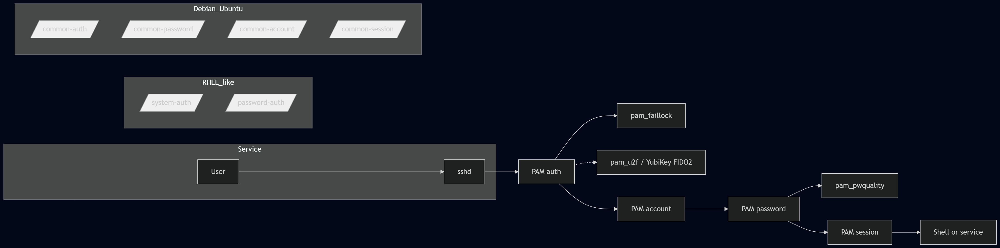

**A practical, reproducible guide for RHEL/Rocky/Alma and Debian/Ubuntu, with Ansible + Molecule examples.**

> **TL;DR:** Secure PAM with `pam_pwquality` (strong passwords), `pam_faillock` (brute-force protection), U2F/YubiKey MFA where it makes sense, and — most importantly — **put everything in code** with Ansible + Molecule. Validate in CI/CD and sleep better at night.

------------------------------------------------------------------------

## Why does PAM still matter?

PAM is Linux's **authentication layer**. A wrong order in the stack can break SSH/`sudo` or allow weak passwords. With **a few well-placed pieces** and **automation**, you gain security, predictability, and the ability to audit every change.

------------------------------------------------------------------------

## What you will implement

1.  **Password complexity** with `pam_pwquality` using `/etc/security/pwquality.conf`.

2.  **Account lockout on failed attempts** with `pam_faillock` and `/etc/security/faillock.conf`.

3.  **MFA with YubiKey (U2F/FIDO2)** via `pam_u2f` (recommended for `sudo`).

4.  **Traceability** with `auditd` monitoring PAM/SSH/sudo.

> 🔐 **Principles**: least privilege, declarative configuration, test before prod, and documented **break-glass** procedure.

------------------------------------------------------------------------

## Multi-distro matrix (avoid manual editing)

- **RHEL/derivatives (Rocky/Alma):** do not edit `system-auth`/`password-auth` directly. Use `authselect` to enable `with-faillock` and `with-pwquality` and apply changes.

- **Debian/Ubuntu:** do not edit `common-*` directly. Use `pam-auth-update` with profiles in `/usr/share/pam-configs/` (enable/disable via the tool).

------------------------------------------------------------------------

## Flow diagram (Mermaid)



------------------------------------------------------------------------

## Step by step (fast and safe)

### 1) Base configuration: `pwquality` and `faillock`

**Sensible values (both families):**

```ini
# /etc/security/pwquality.conf
minlen = 12
minclass = 3
ucredit = -1
lcredit = -1
dcredit = -1
ocredit = -1
maxrepeat = 2
```

```ini
# /etc/security/faillock.conf
deny = 5
unlock_time = 600
fail_interval = 900
# Note: the tally directory is usually /run/faillock on most systems
```

#### RHEL/Rocky/Alma

```bash
sudo dnf install -y libpwquality pam_u2f audit
# Select base profile (adjust to your environment: sssd/winbind/local)
sudo authselect select sssd --force
# Enable features
sudo authselect enable-feature with-pwquality
sudo authselect enable-feature with-faillock
sudo authselect apply-changes
# Deploy policy files
sudo cp pwquality.conf /etc/security/pwquality.conf
sudo cp faillock.conf  /etc/security/faillock.conf
# Verify
authselect check
```

#### Debian/Ubuntu

```text
sudo apt update
sudo apt install -y libpam-pwquality libpam-modules auditd
# Profile for pam-auth-update (faillock)
cat <<'EOF' | sudo tee /usr/share/pam-configs/faillock
Name: Faillock (lock after failed logins)
Default: yes
Priority: 900
Auth-Type: Primary
Auth:
    requisite pam_faillock.so preauth
    [default=die] pam_faillock.so authfail
    sufficient pam_faillock.so authsucc
Account-Type: Primary
Account:
    required pam_faillock.so
EOF
sudo pam-auth-update --enable faillock
# Deploy policy files
sudo cp pwquality.conf /etc/security/pwquality.conf
sudo cp faillock.conf  /etc/security/faillock.conf
```

> ✅ **Quick validation:**
>
> - Use `pwscore` or try setting a weak password to see it rejected.
>
> - Make 5 failed attempts and check `faillock --user <username>`.

------------------------------------------------------------------------

### 2) MFA with YubiKey (U2F/FIDO2) for `sudo` (optional but recommended)

**Installation**

- RHEL/Rocky/Alma: `sudo dnf install -y pam_u2f` (may require EPEL).

- Debian/Ubuntu: `sudo apt install -y libpam-u2f`.

**Key enrollment (centralised mapping)**

```bash
# Enroll YubiKey for the user (repeat with backup key)
mkdir -p ~/.config/Yubico
pamu2fcfg -u "$(whoami)" > ~/.config/Yubico/u2f_keys
# Central mapping for PAM
sudo cp ~/.config/Yubico/u2f_keys /etc/u2f_mappings
sudo chmod 600 /etc/u2f_mappings
```

**Protect** `sudo` **with MFA + break-glass**

```text
# /etc/pam.d/sudo (add near the top)
# Allow emergency group to bypass MFA (break-glass)
auth  [success=1 default=ignore] pam_succeed_if.so user ingroup admins-nomfa
# Require U2F MFA for everyone else
auth  required pam_u2f.so authfile=/etc/u2f_mappings cue=1
```

> 🔁 Enroll 2 keys per user and document your **emergency procedure** (console/iLO/Out-of-Band + break-glass user with rotation and audit trail).

------------------------------------------------------------------------

### 3) Auditing with `auditd`

```bash
# /etc/audit/rules.d/99-hardening.rules
-w /etc/pam.d/          -p wa -k pam_changes
-w /etc/security/       -p wa -k pam_changes
-w /etc/ssh/sshd_config -p wa -k ssh_config
-w /etc/sudoers         -p wa -k sudo_config
-w /etc/sudoers.d/      -p wa -k sudo_config
```

```bash
sudo augenrules --load
sudo systemctl restart auditd
# Queries
sudo ausearch -k pam_changes --start recent
sudo aureport  -k --summary
```

------------------------------------------------------------------------

## Put it in code: Ansible + Molecule

**Role structure**

```text
roles/pam_hardening/
├─ defaults/main.yml
├─ tasks/main.yml
├─ templates/pwquality.conf.j2
├─ templates/faillock.conf.j2
├─ files/pam-configs/faillock   # for Debian/Ubuntu
└─ molecule/default/
   ├─ molecule.yml
   ├─ converge.yml
   └─ tests/test_pam.py
```

`defaults/main.yml`

```yaml
pwquality:
  minlen: 12
  minclass: 3
  ucredit: -1
  lcredit: -1
  dcredit: -1
  ocredit: -1
  maxrepeat: 2
faillock:
  deny: 5
  unlock_time: 600
  fail_interval: 900
```

`tasks/main.yml` (summary)

```yaml
- name: Install base packages
  package:
    name: "{{ item }}"
    state: present
  loop: >-
    {{ (ansible_facts.os_family == 'RedHat') | ternary(
         ['libpwquality', 'pam', 'audit'],
         ['libpam-pwquality', 'libpam-modules', 'auditd']
       ) }}

- name: RHEL | Enable authselect features
  command: >-
    authselect enable-feature {{ item }}
  loop:
    - with-pwquality
    - with-faillock
  when: ansible_facts.os_family == 'RedHat'
  notify: Apply authselect

- name: RHEL | Select sssd profile if not set
  command: authselect select sssd --force
  when: ansible_facts.os_family == 'RedHat'

- name: Debian | Deploy faillock profile for pam-auth-update
  copy:
    src: files/pam-configs/faillock
    dest: /usr/share/pam-configs/faillock
    owner: root
    group: root
    mode: '0644'
  when: ansible_facts.os_family == 'Debian'

- name: Debian | Enable faillock
  command: pam-auth-update --enable faillock
  changed_when: "'No changes' not in result.stdout"
  register: result
  when: ansible_facts.os_family == 'Debian'

- name: Template pwquality.conf
  template:
    src: pwquality.conf.j2
    dest: /etc/security/pwquality.conf
    owner: root
    group: root
    mode: '0644'

- name: Template faillock.conf
  template:
    src: faillock.conf.j2
    dest: /etc/security/faillock.conf
    owner: root
    group: root
    mode: '0644'
```

`handlers/main.yml`

```yaml
- name: Apply authselect
  command: authselect apply-changes
  when: ansible_facts.os_family == 'RedHat'
```

`molecule/default/molecule.yml`

```yaml
platforms:
  - name: rocky9
    image: rockylinux:9
    privileged: true
  - name: ubuntu-24
    image: ubuntu:24.04
provisioner:
  name: ansible
verifier:
  name: testinfra
```

`molecule/default/tests/test_pam.py` (excerpt)

```python
def test_pwquality_file(host):
    f = host.file('/etc/security/pwquality.conf')
    assert f.exists
    assert f.contains('minlen = 12')

def test_pam_chain(host):
    distro = host.system_info.distribution.lower()
    if 'rocky' in distro or 'alma' in distro or 'redhat' in distro:
        pam = host.file('/etc/pam.d/password-auth')
        assert pam.contains('pam_pwquality.so')
    else:
        pam = host.file('/etc/pam.d/common-password')
        assert pam.contains('pam_pwquality.so')
```

**CI/CD (quick idea):**

- `ansible-lint` + `yamllint`.

- `molecule test` on Rocky 9 and Ubuntu 24.04.

- Publish artefacts (guide PDF and changelog).

------------------------------------------------------------------------

## Production checklist

- \[ \] `UsePAM yes` in `sshd_config` if you need PAM in SSH.

- \[ \] `pam_pwquality` with policy aligned to business requirements.

- \[ \] `pam_faillock` with sensible `deny`/`unlock_time`/`fail_interval`; decide whether tally persists across reboots.

- \[ \] U2F/YubiKey MFA on `sudo`, with **second key** and **break-glass group**.

- \[ \] `auditd` monitoring PAM/SSH/sudo with periodic reports.

- \[ \] Ansible role with **green Molecule** in CI.

------------------------------------------------------------------------

## Common mistakes (and how to avoid them)

- **Directly editing** `system-auth`/`password-auth` (RHEL) or `common-*` (Debian): use `authselect`/`pam-auth-update`.

- **Locking out service accounts**: exclude them or apply rules per TTY/service.

- **No recovery plan**: document OOB/console access and rotated emergency users.

- **Changes outside version control**: everything in Git, with PRs and review.

------------------------------------------------------------------------

## Appendix: reference values

- `deny = 5`, `unlock_time = 600`, `fail_interval = 900` typically balance security and usability.

- `minlen = 12`, `minclass = 3` with negative credits to enforce character variety.

- On workstations, consider `pam_u2f` for **GDM** as well; on servers, focus on `sudo`.
