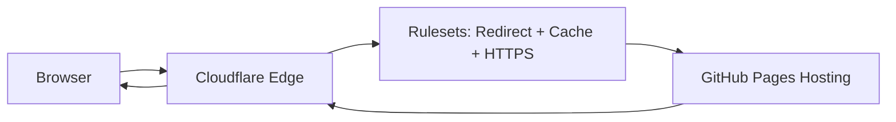

There’s a special moment in every engineer’s life where you sit down, open your laptop, crack your knuckles, and say:

> “Today I’m going to set up a simple website.  
> GitHub Pages + Cloudflare. How hard can it be?”

…and 20 minutes later you’re knee-deep in manually creating DNS records, toggling SSL settings, configuring redirects, debugging Rulesets, and wondering whether Cloudflare’s KV namespaces require a sacrifice to the gods before Terraform accepts them.

If you’ve ever tried to maintain Cloudflare manually — DNS, HTTPS rewrites, redirects, Caching rules, and Pages settings — you already know the pain.

And if you’ve tried automating all of this with **Terraform**…  
well, then you probably met the *beautiful chaos* that is **Cloudflare Provider v5**.

This is the story of how something “simple” turned into two weeks of deep-dive debugging — and the free GitHub template I built so you don’t have to suffer through the same journey.

------------------------------------------------------------------------

# 💥 The Pain Begins: Terraform Cloudflare Provider v5

Cloudflare Provider v5 didn’t just make a few tweaks.  
It brought a **tsunami of breaking changes**.

------------------------------------------------------------------------

## ❌ 1. Resources removed or replaced

Some Terraform resources disappeared entirely. Others were renamed or split into multiple new ones.

```hcl
# v4: used everywhere
resource "cloudflare_page_rule" "redirect" { ... }

# v5: nope, now use rulesets
resource "cloudflare_ruleset" "redirect" { ... }
```

------------------------------------------------------------------------

## ❌ 2. The Great Rulesets Migration

Rulesets are powerful.  
Rulesets are flexible.  
Rulesets are… not documented consistently.

Migrating from Page Rules to Rulesets requires new blocks, phases, expressions, actions, and sometimes zone-level instead of account-level.

------------------------------------------------------------------------

## ❌ 3. Zone Settings Override limitations

Some settings are *only* allowed at account-level. Others *only* at zone-level. Terraform shows:

```text
Error: cannot modify setting at zone level
```

…without telling you where you *should* modify it.

------------------------------------------------------------------------

## ❌ 4. API Token scopes became a labyrinth

You now need extremely precise permissions.

Miss **one** scope — even a read-only one — and Terraform explodes.

------------------------------------------------------------------------

## ❌ 5. Account-level vs Zone-level divergence

- DNS → zone-level
- Cache rules → zone-level
- Redirects → account-level
- Pages → account-level

If you configure something on the wrong side, Terraform fails.

------------------------------------------------------------------------

# 🙋‍♂️ Why This Matters for Solo Engineers, Homelab Builders, and Small DevOps Teams

Most of us don’t want to architect a global CDN strategy.

We just want:

- a static site
- GitHub Pages
- Cloudflare
- DNS automated
- SSL working
- redirects configured
- caching optimized

Terraform v5 turned this simple workflow into:

> “Let me spend three hours debugging a zone-level setting just to redirect www → apex.”

------------------------------------------------------------------------

# ✅ Introducing My Free Template: Terraform + Cloudflare + GitHub Pages

A clean, minimal, reproducible template that:

- Works with provider v4 (or v5 with small edits)
- Creates GitHub Pages DNS
- Configures SSL
- Creates redirects
- Adds cache rules
- Documents API token scopes
- Requires zero Cloudflare dashboard clicks

------------------------------------------------------------------------

# 🛠️ What the Template Solves

### ✔ DNS Records for GitHub Pages

### ✔ GitHub Pages CNAME Handling

### ✔ Redirect www → apex

### ✔ HTTPS rewrite & security settings

### ✔ Cache rules for static assets

### ✔ Clean API Token requirements

------------------------------------------------------------------------

# 🧩 Example Terraform Code

### DNS Record

```hcl
resource "cloudflare_record" "github_pages" {
  zone_id = var.zone_id
  name    = "@"
  type    = "CNAME"
  value   = "${var.github_username}.github.io"
  proxied = true
}
```

### Redirect

```hcl
resource "cloudflare_ruleset" "redirect_www_to_apex" {
  name    = "www-to-apex"
  zone_id = var.zone_id
  kind    = "zone"
  phase   = "http_request_redirect"

  rules {
    expression = "(http.host eq \"www.${var.domain}\")"
    action     = "redirect"

    action_parameters {
      from_value {
        status_code = 301
        target_url  = "https://${var.domain}/"
      }
    }
  }
}
```

### Cache Static

```hcl
resource "cloudflare_ruleset" "cache_static" {
  name    = "cache-static"
  zone_id = var.zone_id
  kind    = "zone"
  phase   = "http_request_cache_settings"

  rules {
    expression = "(http.request.uri.path matches \".*\\.(css|js|png|jpg|svg|ico)\")"
    action     = "set_cache_settings"

    action_parameters {
      cache = true
      edge_ttl {
        mode         = "override_origin"
        default      = 2592000
      }
    }
  }
}
```

------------------------------------------------------------------------

# 🔎 Architecture Diagram



------------------------------------------------------------------------

# 🧠 Lessons Learned from Migrating to v5

- Always use a sandbox zone
- Documentation lags behind API and TF provider
- Be explicit with API token scopes
- Don’t mix account/zone configs blindly
- Cache & redirect rules are fragile

------------------------------------------------------------------------

# 🚀 Final Thoughts

If you want to avoid the suffering and deploy Cloudflare + GitHub Pages cleanly:

👉 **GitHub Repository:** *(https://github.com/malpanez/terraform-cloudflare-github-pages)*  
👉 **Hashnode Blog:** *(https://blog.homelabforge.dev/surviving-cloudflare-terraform-provider-v5-pain-breaking-changes-and-a-free-template-for-github-pages)*

Happy automating!
